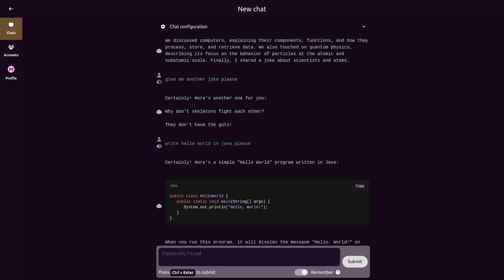

# Chatter

<a href='https://ko-fi.com/recoskyler' target='_blank'></a>


A simple, free, and open-source OpenAI ChatGPT client with multi-account support.

You can either self-host it, or [start using it now](https://chatter.recoskyler.com)!



## Features

### Multi-chat support

You can create up to 100 chats (can be configured in `.env` in case of self-deployment).

### Multi-account support

You can have multiple accounts (API keys) defined, and switch between accounts on the fly. Each account can use a different [ChatGPT model](#supported-models).

This is very useful in the case of having a personal, and a business OpenAI account, each having their distinct API keys.

**Chatter does not come with ant warranty/liability. API keys are stored as plain text in the database and it is your responsibility to set appropriate [usage limits](https://platform.openai.com/account/billing/limits).**

### Toggle prompt/remember support

You can enable/disable remembering of the previous prompts. If enabled, previous prompts in the chat will also be submitted alongside the latest prompt.

**Keep in mind, enabling the remember option will cost more tokens.**

You can also toggle each prompt on/off if the remember option is enabled. This will allow you to submit/not submit selected prompts in order to fine-tune the response from ChatGPT.

### Light/Dark themes

*Does this even need an explanation?*

## Supported models

- ChatGPT 3.5 Turbo
- ChatGPT 3.5 Turbo (16K tokens)
- ChatGPT 4
- ChatGPT 4 (32K tokens)

## Status

**Currently in Usable stage.** This project will receive updates if it proves itself to be useful. Please use the [main](/recoskyler/chatter/tree/main) branch for the stable version.

- [X] Multi-chat
- [X] Multi-account
- [X] Delete/Restore chat
- [X] ~~Import/Export chat~~
- [X] Toggle prompt
- [X] Remember toggle (remember previous prompts/send only the last prompt)
- [X] ~~Local storage~~
- [X] Dockerization
- [X] Database storage
- [X] Mobile layout
- [X] Themes
- [ ] I18N (maybe)

## Tech Stack

- [SvelteKit 4](https://kit.svelte.dev/)
- [Drizzle ORM](https://orm.drizzle.team/)
- [Lucia Auth v2](https://lucia-auth.com/)
- [Skeleton](https://www.skeleton.dev/)/[Tailwind CSS](https://tailwindcss.com/)

## Requirements

- Node ^18
- NPM/PNPM
- Vite

## Development

### Setup

1. Clone the repository `git clone https://github.com/recoskyler/chatter`
2. Go into the repository directory `cd chatter`
3. Create your `.env` file `cp sample.env .env`
4. Open the `.env` file and set your environment variables. Save when you are done editing.
5. Install the dependencies `npm i`
6. Generate migrations `npm run generate`. Migrations will automatically run when you start the app.

### Running

The following command will run the database as a Docker container.

```bash
$ docker compose up -d
```

If you have the database set up already, and you would like the hot-reload to work:

```bash
npm run dev -- --open
```

When you run the app using the command above, you can access it through [http://127.0.0.1:5173](http://127.0.0.1:5173).

### Building

To create a production version of your app:

```bash
npm run build
```

You can preview the production build with `npm run preview`.

## About

By [recoskyler](https://github.com/recoskyler) - 2023

### Legal

- [Disclaimer](https://chatter.recoskyler.com/disclaimer)
- [Cookie Policy](https://chatter.recoskyler.com/cookie)
- [Privacy Policy](https://chatter.recoskyler.com/privacy)

### License

Chatter is licensed under [GNU Affero General Public License v3.0](https://github.com/recoskyler/chatter/blob/main/LICENSE)
