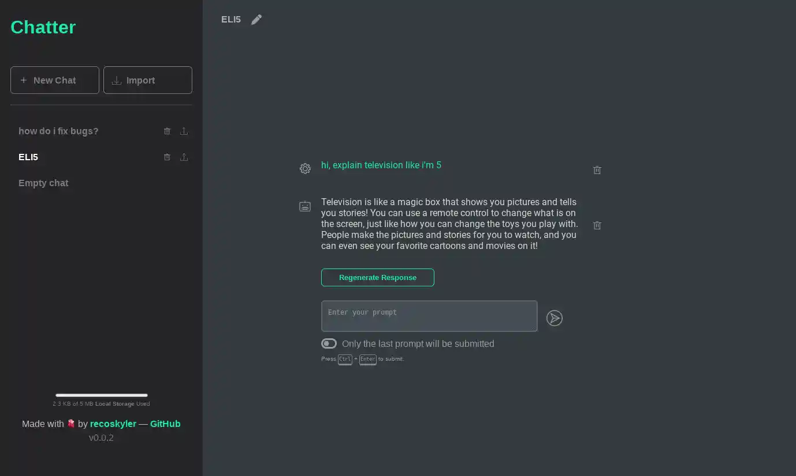

# Chatter

<a href='https://ko-fi.com/recoskyler' target='_blank'></a>

A self-hosted OpenAI ChatGPT client.



## Status

**Currently in Usable stage.** This project will receive updates if it proves itself to be useful. Please use the [main](/recoskyler/chatter/tree/main) branch for the stable version.

- [X] Multi chat
- [X] Delete/Restore chat
- [X] Import/Export chat
- [X] Delete/Restore prompt
- [X] Remember toggle (remember previous prompts/send only the last prompt)
- [X] Local storage
- [X] Dockerization
- [ ] Database storage (*In-progress*)
- [ ] Mobile layout (*In-progress*)
- [ ] I18N (maybe)
- [ ] Themes (maybe)

## Tech Stack

- [SvelteKit 4](https://kit.svelte.dev/)
- [Drizzle ORM](https://orm.drizzle.team/)
- [Lucia Auth](https://lucia-auth.com/)
- [Skeleton](https://www.skeleton.dev/)/[Tailwind CSS](https://tailwindcss.com/)

## Requirements

- [Docker](https://docs.docker.com/get-docker/)
- [Docker Compose](https://docs.docker.com/compose/install/linux/)
- Node ^18
- NPM/PNPM
- Vite

## Development

### Setup

1. Clone the repository `git clone https://github.com/recoskyler/chatter`
2. Go into the repository directory `cd chatter`
3. Create your `.env` file `cp sample.env .env`
4. Open the `.env` file and set your environment variables. Save when you are done editing.
5. Install the dependencies `npm i`
6. Generate migrations `npm run generate`. Migrations will automatically run when you start the app

### Running

The following command will run the app and the database as a Docker container. Your changes will not effect the app.

```bash
$ docker compose up -d
```

or if you have a database set up already, and you would like the hot-reload to work:

```bash
npm run dev -- --open
```

### Building

To create a production version of your app:

```bash
npm run build
```

You can preview the production build with `npm run preview`.

## About

By [recoskyler](https://github.com/recoskyler) - 2023
